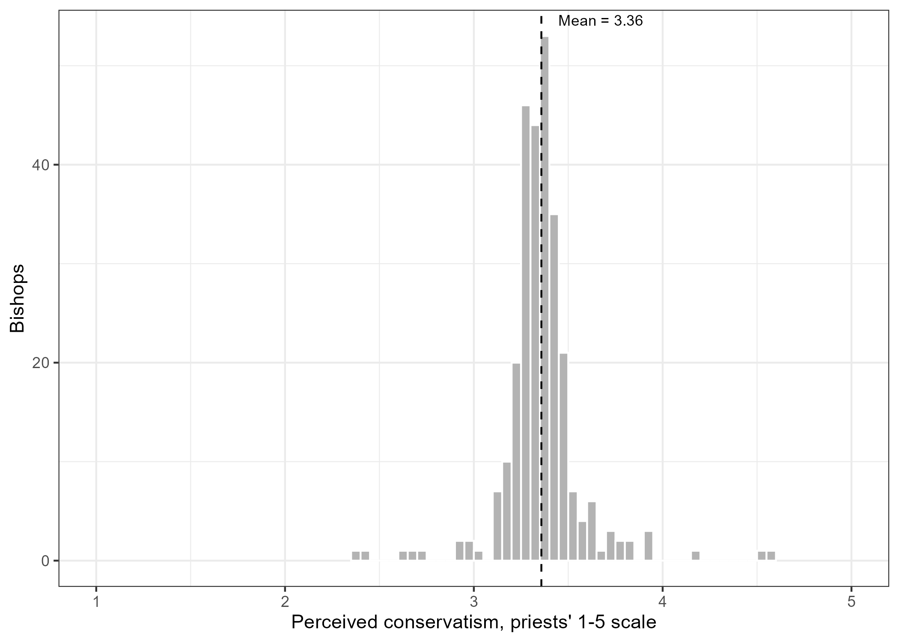

::: {.justified}

Scholarship on elite ideology has relied on roll-call votes, campaign contributions, and self-placement.
Little is known about elites who leave none of these.
I present the first ideological measure of U.S. Catholic bishops, estimated with a Bayesian Bradley-Terry model from 1,283 pairwise comparisons elicited from seminarians, clergy, and other informed Catholic elites.
The scores place 277 bishops on the same five-point scale priests use for themselves in the National Study of Catholic Priests.
The American Catholic hierarchy is concentrated, not polarized.
Its perceived spread is a fifth of the priests’.
Twenty-seven bishops in the tails carry four fifths of the variance.
Appointing pope, Roman education, rite, rank, religious order, and the party of the U.S. president at appointment all fail to sort bishops.
No bishop score correlates above 0.11 with forty-five measures of priests’ priorities, ministries, and conduct.
An elite this unpolarized is one whose cues theory expects to be weak.

:::

::: {.justified}

*Note.* Perceived conservatism for 277 bishops, on the same five-point scale priests use for themselves in the National Study of Catholic Priests.
The dashed line marks the mean, 3.36.
Almost the entire hierarchy falls between 3 and 4, with only a scattering of bishops in either tail.
This is the concentration the paper documents: a spread roughly a fifth of the priests' own.

:::

**Presented.**

- "Ideological Variation Among U.S. Catholic Bishops: Scores, Networks, and Electoral Implications" — Midwestern Political Science Association, Chicago, IL, Spring 2026
- "The Political Ideology of Catholic Bishops" — Research and Analysis in the Sociology of Religion, University of Notre Dame, Fall 2025
