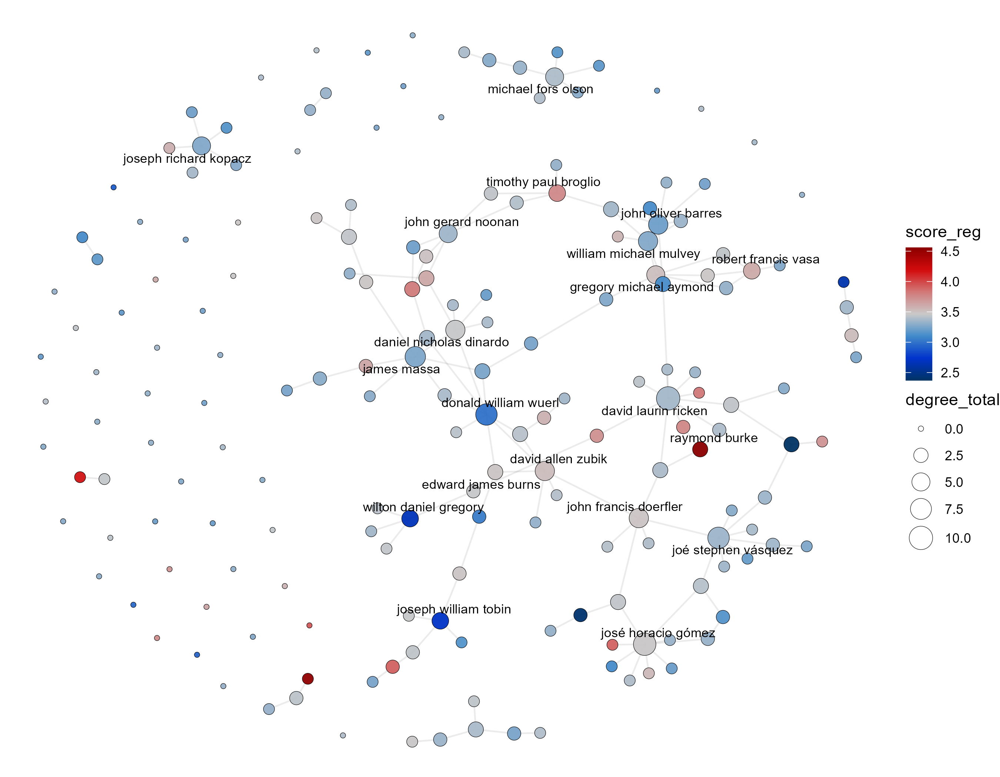

::: {.justified}

Catholic bishops are connected to one another through documented relations of patronage and preferment, and those relations can be represented as a network.
Bullivant and Sadewo (2022) construct such a network for the United States and for England and Wales using the Ordinary-subordinate tie — one bishop having served under another — assembled by hand from diocesan records.
That the network carries real consequences is established: core-periphery analysis of the same relations supports the long-standing claim that Theodore McCarrick functioned as a kingmaker, through the subsequent promotion of priests and bishops who had served under him.
The network moves careers.
Whether it also moves ideology is a separate question, and it is the extension the network's own authors identify as the next step, blocked by the difficulty of operationalizing ideological leaning when many bishops remain silent about their positions.
A perceptual measure removes that obstacle precisely because it does not require the bishop to say anything.
A regressed score attaches to 188 of the 425 bishops in their matrix, 44.2 percent, and the analysis runs on that subgraph alone.
Connectivity does not track ideology.
The Spearman correlation between total degree and score is 0.141 (*p* = 0.05), sharing 2 percent of the rank variance, and two things argue against reading it as a finding: Pearson on the same variables is −0.001, pointing the other way, and degree takes only 11 distinct values across 188 bishops, leaving 177 tied values.
Indegree, being named by another scored bishop, is flat at −0.009; outdegree carries the whole positive coefficient at 0.166 but takes only four values.
The result is best read alongside the promotion finding rather than on its own: the same Ordinary-subordinate network that demonstrably transmits advancement does not transmit ideological orientation.
A network that moves careers without moving positions is a more informative object than either fact separately.

:::

::: {.justified}

*Note.* The 188 bishops carrying a score, laid out force-directed.
Node color is perceived ideology on the priests' five-point scale, blue for liberal through white at the episcopal mean to red for conservative.
Node size is total degree, and the twenty most connected bishops are labeled.
Colors are interspersed rather than clustered throughout the large component, and the isolates on the periphery span the full range.

:::

## Limits

::: {.justified}

Three limits belong with the result rather than beneath it.
The test runs on those bishops matchable between the published network and the scored roster rather than on the full set, so its power is lower than the complete roster would allow and the claim is properly about the matched subnetwork; a replication covering every scored bishop is in progress.
Only one tie type is examined, and several others are available in principle — co-consecrators at episcopal ordination, shared seminary and years of study, joint service on committees, and the bishops honored in a prelate's coat of arms — so an absence of homophily on this relation is not an absence on all of them.
And the appropriate methodological next step, exponential random graph modeling, is one the network's authors recommend and this analysis does not yet employ.

:::

**Status.** Working paper, actively under development.

**Data.** Network data from Bullivant and Sadewo, "Power, Preferment, and Patronage: An Exploratory Study of Catholic Bishops and Social Networks."
Ideal point estimates from [Ideology and Priorities in an Organizational Hierarchy](bishop-ideology.qmd).
