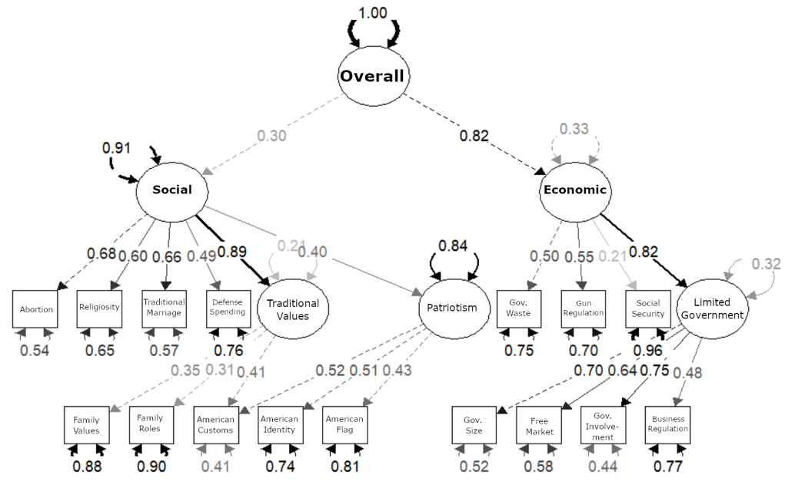

::: {.justified}

Researchers across several fields make extensive use of the concept of ideology.
Yet despite its ubiquity, ideology continues to be measured with scales that carry substantial conceptual and methodological problems.
I propose a new scale for identifying social and economic conservatism that treats the two as distinct dimensions rather than points on a single continuum.
The scale measures conservatism directly rather than through evaluative proxies, requires no specialized political knowledge of respondents, and is shorter than traditional instruments while retaining enough items to avoid truncation.
Because it draws on ANES items rather than ad hoc measures such as feeling thermometers, it also supports comparison across decades.
Replicating past research on affective polarization, I show the scale generates important complementary insights for researchers studying ideology.

:::

::: {.justified}

*Note.* Standardized estimates.
Rectangles are ANES items, ovals are latent factors.
Overall conservatism resolves into a social and an economic dimension, each carrying its own sub-factors — traditional values and patriotism on the social side, limited government on the economic.
The two dimensions are not interchangeable: overall conservatism loads 0.82 on the economic factor and 0.30 on the social one, which is the case for treating them separately rather than collapsing them onto a single left-right axis.
Social security spending is the weakest indicator at 0.21, and is retained on conceptual grounds despite that.

:::

**Thesis.** Master of Arts Program in the Social Sciences, University of Chicago.

**Presented.** American Politics Workshop, University of Chicago — Fall 2019.
